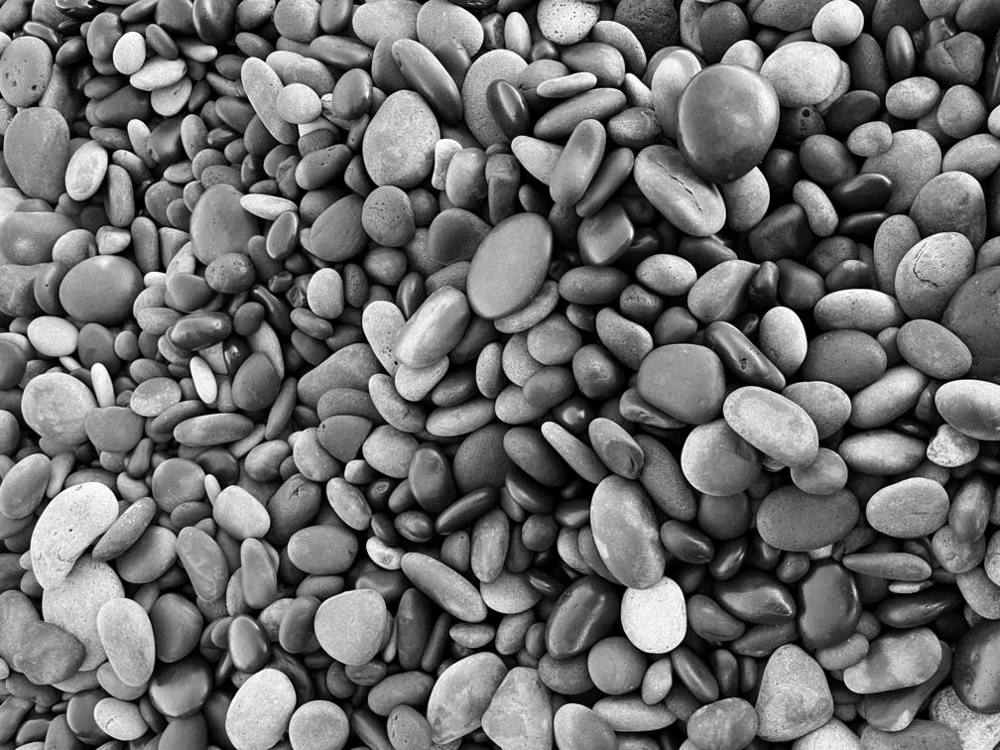
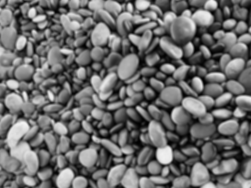
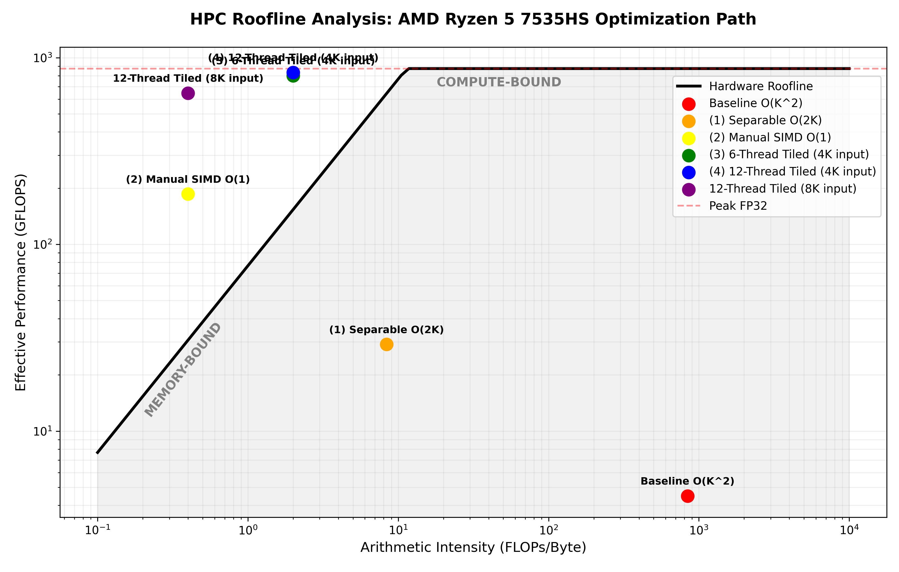

# HPC Optimization for Image Convolution

## Overview

* [Motivation](#motivation)
* [Lessons Learned](#lessons-learned)
* [Input Image and the Convolution Kernel](#input-image-and-the-convolution-kernel)
* [Mathematical Framework for Image Convolution](#mathematical-framework-for-image-convolution)
* [My CPU: AMD Ryzen 5 7535HS (Zen 3+)](#my-cpu-amd-ryzen-5-7535hs-zen-3)
* [Performance Metrics](#performance-metrics)
* [Benchmarking Engine](#benchmarking-engine)
* [The Baseline](#the-baseline)
* [Stage 1: Separable Convolution](#stage-1-separable-convolution)
* [Stage 2: Sliding Sum](#stage-2-sliding-sum)
* [Stage 3: Manual SIMD](#stage-3-manual-simd)
* [Stage 4: Scaling with 6 Physical Cores](#stage-4-scaling-with-6-physical-cores)
* [Stage 5: Testing 12 Threads with SMT](#stage-5-testing-12-threads-with-smt)
* [The Memory Latency Stress Test](#the-memory-latency-stress-test)
* [Roofline model](#roofline-model)
* [Scaling Up: Moving to MPI](#scaling-up-moving-to-mpi)
* [Performance Results: CPU vs. GPU](#performance-results-cpu-vs-gpu)
* [Wrapping Up](#wrapping-up)

## Motivation

In my previous [project](https://github.com/alexander-klokov/image-convolution), I optimized a CUDA kernel for image convolution and reached 99.5% of the GPU’s peak performance. This post is a direct sequel. The goal is the same—applying a _41x41_ filter to a _4032x3024_ image—but now I'm focusing on the CPU. I want to explore the step-by-step process of moving from a simple baseline to a high-performance version that uses the CPU's memory and cache most efficiently.

## Lessons Learned

- Know your algorithm. Apply the Big-O arithmetics.
- Cache is king. Use tiling to keep data near the execution units and avoid the DRAM tax.
- Respect memory latency. Cache coherency and access latency dictate the final speed once data exceeds the L3 cache, long before bandwidth is saturated.
- Physical cores first. SMT offers little benefit for saturated vector pipelines and causes resource contention.
- Master the flags. Hardware-native compilation is the shortcut to performance.
- Smart math beats raw power. An $O(1)$ algorithm on a CPU can outrun a brute-force $O(K^{2})$ kernel on a GPU.

## Input Image and the Convolution Kernel

I am using a 4032x3024 PGM (Portable Gray Map) image for this experiment. This 12.2-megapixel grayscale image allows me to focus on the convolution logic without the complexity of color channels. I specifically chose a width of 4032 pixels because it is a multiple of 64, which aligns perfectly with the CPU cache line size. By using the binary P5 format, the program loads the entire 12.2 MB of data in one operation. This minimizes I/O time and ensures my benchmarks focus strictly on the convolution kernel's performance.

I am applying a $41 \times 41$ box filter to this 4K resolution input. This kernel size is intentional. Because each output pixel requires 1,681 operations, the bottleneck shifts from memory bandwidth to instruction throughput. 

On the CPU, the optimization strategy changes. I no longer manage warps or shared memory. Instead, I must keep the data in L1 and L2 caches and ensure that the code uses AVX2 vector units. A $41 \times 41$ window is large enough that a naive implementation causes cache thrashing. This makes it an excellent case for testing loop tiling and SIMD vectorization.

The blurring effect at the output allows for a quick quality check—I just need to open the output image and make sure it is blurred.

## Mathematical Framework for Image Convolution

To evaluate the efficiency of my HPC engine components, I define the workload using three core metrics:

#### Computational Workload ($N_{ops}$)

For an image of size $W \times H$ and a square kernel $K \times K$:

$$N_{ops} = (W \times H) \times K^{2}$$

For my $4032 \times 3024$ image and $41 \times 41$ kernel: $\approx 20.5$ GFLOPs.

#### Memory Traffic ($D_{total}$)

Since I'm processing a 1-byte-per-pixel grayscale image:

$$D_{total} = (W \times H \times 1 \text{ byte}_{\text{read}}) + (W \times H \times 1 \text{ byte}_{\text{write}}) \approx 24.4 \times 10^{6} \text{ Bytes}$$

#### Arithmetic Intensity ($I$)

This ratio determines if my application is compute-bound or memory-bound:

$$I = \frac{N_{ops}}{D_{total}} \approx 840 \text{ FLOPs/Byte}$$

The value of 840 FLOPs/Byte provides a clear diagnosis: my application is strictly _compute-bound_.

## My CPU: AMD Ryzen 5 7535HS (Zen 3+)

For this experiment, I am using a *6-core, 12-thread Zen 3+* mobile processor. Achieving peak performance for image convolution on this architecture depends on several critical hardware pillars:
- _Topology & SMT_: 6 physical cores with 12 logical threads. For compute-heavy convolution kernels, pinning threads to the 6 physical cores often yields better results by eliminating resource contention between SMT siblings.
- _Cache Architecture_: L1: 384 KiB (32 KiB L1i + 32 KiB L1d per core) private; L2: 3 MiB (512 KiB per core) private; L3: 16 MiB Unified. The L1 data cache provides ultra-low latency access for immediate kernel coefficients and local pixel values during tight execution loops. This hierarchy is complemented by the shared L3 pool, which is vital for image processing as it allows efficient data reuse for sliding-window operations and tile-based threading without frequent trips to RAM.
- _Vectorization (SIMD)_: Support for AVX2 (256-bit vectors) and FMA ($a = b \times c + d$). These instructions are the primary engine for convolution, allowing up to 32 single-precision operations per cycle per core.

_Note: I'm running on WSL2 (Microsoft Hypervisor). While it provides near-native execution speeds, the virtualization layer can subtly influence memory management and low-level performance counters during profiling._

## Performance Metrics

To quantify the success of each optimization stage, I utilize a multi-dimensional metric suite. While "seconds elapsed" is the ultimate goal, these metrics diagnose whether the bottleneck resides in the instruction pipeline, the memory subsystem, or the algorithmic design.

#### Throughput ($G$)

Measured in Giga-Floating Point Operations per Second (GFLOPS). This represents the "velocity" of my computation.

$$G = \frac{N_{ops}}{\text{time} \times 10^{9}}$$

_Note: I report Effective GFLOPS — defined by the operations required by the baseline $O(K^2)$ algorithm — rather than Raw GFLOPS. This metric more accurately quantifies the practical speedup achieved through algorithmic optimization_

#### Theoretical Peak ($P_{peak}$)

To establish the hardware "ceiling," I calculate the maximum performance of the Ryzen 5 7535HS. For single-precision (FP32) arithmetic using AVX2 and dual FMA units, the peak throughput is determined by:

$$P_{peak} = \text{Cores} \times \text{Clock Speed (GHz)} \times 32 \text{ FLOPs/cycle}$$

For a single core boosting to $4.55 \text{ GHz}$: $1 \times 4.55 \times 32 = \mathbf{145.6 \text{ GFLOPS}}$.

For the full 6-core chip, this scales to an aggregate theoretical maximum of $873.6 \text{ GFLOPS}$.

#### Hardware Efficiency ($\eta_{hw}$)

A critical diagnostic for HPC performance. It measures how much of the available silicon throughput we are actually saturating.

$$\eta_{hw} = \left( \frac{G}{P_{peak}} \right) \times 100\%$$

#### Speedup ($S$)

I measure the relative improvement of each stage ($T_{new}$) against the baseline ($T_{base}$):

$$S = \frac{T_{base}}{T_{new}}$$

#### The Roofline Model

 I evaluate the kernel against the Roofline Boundary, which sets a limit on performance based on the relationship between Arithmetic Intensity ($I$) and Peak Memory Bandwidth ($B$). In this model, an implementation is either "Memory-Bound" (limited by data transfer) or "Compute-Bound" (limited by the GFLOPS ceiling).

## Benchmarking Engine

To measure true hardware speed, I'm trying to filter out unpredictable system noise. First, my benchmarking engine performs an untimed "warm-up" run to load data into the CPU caches. Then, it times the code across multiple runs and reports the _minimum execution time_. I prefer the minimum time over the average because it shows the absolute fastest the hardware can perform when it is not interrupted by background operating system tasks.

#### Profiling

I use the Linux `perf` tool to see exactly how the hardware handles the code. By tracking Instructions Per Cycle (IPC) and cache misses, I can evaluate how each change improves performance. This data proves that the speed gains are real and shows exactly when the memory bandwidth becomes the final limit for the system.

## The Baseline

To start this experiment, I need a strong serial baseline. I didn't want to write _naive code_; I wanted to see the maximum possible speed for a _naive algorithm_ on a single core.

#### Algorithm

In my implementation, I use physical padding ($R=20$). By adding 20 pixels of padding around the image data before the timing starts, I remove all if-statements from the inner convolution loop. This allows the CPU to process the data without branch mispredictions. I also optimizd the math by replacing division with multiplication. A box filter needs to divide the sum by the kernel area ($1681$). Since division is a slow operation for the FPU, I pre-calculated the reciprocal ($1.0f / 1681.0f$) and used it as a multiplier.

#### Architecture and Cache

While the total L1d of my Ryzen 5 7535HS is 192 KiB, each individual core manages a 32 KiB private L1d cache. With a working set of $\approx 166.9$ KiB for the 41-row sliding window, the data resides primarily in the 512 KiB private L2 cache. This confirms that the baseline's bottleneck is a combination of L1 misses and scalar instruction latency.

#### The Power of the "Basics": A 4x Speedup via Compilation Flags

In high-performance software development, the distance between "working code" and "performant code" often starts at the compiler level. By moving away from a generic debug build and explicitly configuring a Release environment in CMake, I achieved a 3.5x performance boost — from 16.5 seconds down to just 4.7 seconds — without altering a single line of C++ logic. This optimization relied on a strategic combination of flags: `-O3` for aggressive vectorization, `-march=native` to unlock the specific SIMD instructions of my architecture, and `-ffast-math` to streamline calculations. For any engineer tasked with developing and configuring HPC engine components, this is a foundational step: *before implementing complex distributed patterns, we must first ensure the compiler is fully empowered to leverage the hardware*.

#### Baseline Performance Evaluation

The baseline serial implementation retired the workload in 4794 ms. This yields a throughput of 4.28 GFLOPS. While the Arithmetic Intensity ($840.5$ FLOPs/Byte) suggests a _compute-bound_ problem, the hardware efficiency of 2.94% indicates significant 'instruction starvation' — the core is waiting on scalar logic rather than saturating its SIMD vector units.

- **Elapsed Time**: 4794 ms
- **Hardware Efficiency** ($\eta_{hw}$): 2.94%
- **IPC**: 3.61
- **Instructions Retired**: 796 Billion
- **L1-dcache Miss Rate**: 0.27%
- **Effective Throughput ($G$)**: 4.28 GFLOPS
- **Arithmetic Intensity ($I$)**: 840.5 FLOPs/Byte
- **Speedup ($S$)**: 1.00x

_The Compute Well_: Despite the hardware being highly utilized, the efficiency ($\eta_{hw}$) is only 2.94%. This "Efficiency Paradox" occurs because the CPU is doing exactly what it was told to do — retiring nearly 800 Billion instructions — but those instructions are mostly scalar math that could be vectorized.

_Memory Impact_: With an L1-dcache miss rate of only 0.27%, the working set fits perfectly within the cache hierarchy. I am not yet limited by the "Memory Wall"; I am limited by the raw volume of mathematical operations required by the $O(K^2)$ algorithm.

## Stage 1: Separable Convolution

A separable convolution works by splitting a single 2D kernel (a $K \times K$ matrix) into two smaller 1D kernels: one horizontal and one vertical. Instead of performing a heavy 2D calculation for every pixel, the algorithm first applies the horizontal 1D filter and then applies the vertical 1D filter to the result. Because these two passes are mathematically equivalent to the original 2D operation, the final image is the same, but the computational cost is significantly lower. Specifically, the complexity drops from $O(K^2)$ to $O(2K)$ operations per pixel, making the process much faster—especially as the filter size increases.

By transitioning to a Separable Convolution ($O(2K)$), the execution time dropped to 451 ms, delivering an Effective Throughput of 45.46 GFLOPS. Interestingly, the Raw Throughput decreased to 1.45 GFLOPS. This highlights a classic HPC trade-off: while we drastically reduced the total operation count, we increased the memory pressure by introducing an intermediate 4-byte floating-point buffer. With the Arithmetic Intensity falling to 8.35 FLOPs/Byte, the implementation is no longer just limited by the instruction pipeline, but is now actively fighting memory latency.

- **Elapsed Time**: 451 ms
- **Hardware Efficiency** ($\eta_{hw}$): 1.52%
- **IPC**: 2.80
- **Instructions Retired**: 52.33 Billion
- **L1-dcache Miss Rate**: 4.72%
- **Effective Throughput ($G$)**: 45.46 GFLOPS
- **Arithmetic Intensity ($I$)**: 8.35 FLOPs/Byte
- **Speedup ($S$)**: 10.63x

_Algorithmic Win vs. Hardware Struggle_: By moving from $O(K^2)$ to $O(2K)$, I removed 93% of the required instructions (from 796B down to 52B). This is why the execution time collapsed from 4.8s to 0.45s. However, the hardware is now struggling to keep those remaining instructions fed.

_The Memory Wall Hit_: The L1-dcache miss rate spiked from 0.27% to 4.72%. This is the diagnostic "fingerprint" of the vertical pass. Because the CPU must jump 4032 bytes (one full row) to grab the next pixel in a vertical sum, it is constantly pulling new cache lines and discarding old ones.

_IPC Degradation_: The IPC dropped from 3.61 to 2.80. The stalls aren't coming from math complexity; they are coming from the Load-Store Units waiting for data from the L3 cache or DRAM. The CPU is effectively "idling" more often while it manages the 48.8 MB intermediate floating-point buffer.

## Stage 2: Sliding Sum

Next, I apply a Sliding Window algorithm. Instead of re-summing all $K$ pixels for every new position, this algorithm takes the sum from the previous pixel, subtracts the one pixel leaving the window, and adds the one pixel entering it. This reduces the workload to a constant two operations per pixel, making it independent of the kernel size. By maintaining a "running sum" of columns, I reduced the work per pixel from $O(2K)$ to a constant $O(1)$ operations.

- **Elapsed Time**: 58.4 ms
- **Hardware Efficiency** ($\eta_{hw}$): 241%
- **IPC**: 2.17
- **Instructions Retired**: 3.03 Billion
- **L1-dcache Miss Rate**: 3.39%
- **Effective Throughput ($G$)**: 350.96 GFLOPS
- **Arithmetic Intensity ($I$)**: ~0.4 FLOPs/Byte - drastic drop due to $O(1)$ operation count
- **Speedup ($S$)**: 82.09x

_Algorithmic Super-Peak_: My hardware efficiency of 241% is technically "impossible" in a brute-force context. It indicates that the $O(1)$ algorithm is so much more efficient than the $O(K^2)$ baseline that the CPU is delivering the work equivalent of 351 GFLOPS, even though the physical ALUs are only retiring a fraction of that in raw operations (~0.83 Raw GFLOPS).

_IPC Decline_: Note the significant drop in IPC to 2.17, compared to 3.61 in the baseline. While the original version was dominated by dense mathematical operations that the CPU handles efficiently, the current implementation requires the CPU to manage sliding buffers and update column sums for every pixel. This introduces more instruction dependencies and pointer arithmetic, which the Zen 3+ architecture cannot parallelize as effectively as simple floating-point math.

_Memory Latency Overhead_: The L1 miss rate of 3.39% and the significant 0.52s system time suggest I am now hitting memory latency limits.

## Stage 3: Manual SIMD

In this stage, I transition from compiler-dependent code to manual AVX2 Intrinsics. AVX2 (Advanced Vector Extensions 2) is a 256-bit SIMD (Single Instruction, Multiple Data) instruction set extension for the x86 architecture. It expands the capabilities of the processor by allowing it to perform the same mathematical operation on multiple data elements simultaneously using wide YMM registers.

For computationally intensive tasks, AVX2 enables the parallel processing of eight 32-bit single-precision floats or four 64-bit double-precision floats in a single clock cycle. By using manual intrinsics, you gain granular control over these registers, allowing you to maximize instruction density and arithmetic throughput in ways that standard compiler auto-vectorization might overlook.

#### Overcoming the AVX2 Lane-Crossing Barrier

The most significant challenge in the SIMD pipeline is the "Demotion" (converting `float32` results back to `uint8_t`). In the AVX2 ISA, packing instructions like `_mm256_packus_epi32` are lane-bound — they operate within the two isolated 128-bit halves of the register. Without intervention, a standard pack results in a "shuffled" output ($[0,1,4,5,2,3,6,7]$).

To maintain linear pixel order for the PGM format, I implemented a cross-lane permutation strategy:

1. *Conversion*: `_mm256_cvtps_epi32` transforms 8 floats into 32-bit integers.
2. *First Pack*: `_mm256_packus_epi32` compresses $8 \times 32$-bit to $8 \times 16$-bit (data is now out of order across lanes).
3. The Fix: `_mm256_permute4x64_epi64` with the `0xD8` mask swaps the inner 64-bit blocks across the lane boundary, restoring perfect linear order.
4. *Final Pack & Store*: A final `_mm256_packus_epi16` and `_mm_storel_epi64` writes exactly 8 pixels (64 bits) to memory.

#### Performance Evaluation

This implementation reaches an Effective Throughput of 448.49 GFLOPS. While this exceeds the hardware's theoretical FP32 peak of 145.6 GFLOPS, it is important to note that the Raw GFLOPS (actual instructions retired) is significantly lower ($\approx 0.88$ GFLOPS). This 'super-peak' is the result of the $O(1)$ algorithm doing significantly less math to achieve the same result as the $O(K^2)$ baseline.

- **Elapsed Time**: 45.7 ms
- **Hardware Efficiency** ($\eta_{hw}$): ~0.62%
- **IPC**: 2.10
- **Instructions Retired**: 1.48 Billion
- **L1-dcache Miss Rate**: 8.60%
- **Effective Throughput ($G$)**: 448.49 GFLOPS
- **Arithmetic Intensity ($I$)**: ~0.4 FLOPs/Byte
- **Speedup ($S$)**: 104.90x

_Instruction Density Win_: Moving to AVX2 cut my instruction count from 3.03 Billion (Stage 2) down to 1.48 Billion. This is the direct result of processing 8 pixels per instruction. However, my IPC stayed relatively flat (2.17 to 2.10). This indicates that the CPU isn't stalled by instruction volume, but by the latency of the cross-lane shuffles and data dependencies required to maintain the sliding sum logic.

_The "Cache Tax"_: My L1-dcache miss rate doubled from 3.39% to 8.60%. As the execution speed increases (thanks to SIMD), the hardware prefetcher has less time to "stay ahead" of the vertical pass jumps. I am now retiring instructions so fast that the L1 cache can no longer act as a perfect buffer, forcing more frequent stalls for L2/L3 data fetches.

_AVX2 Lane Crossing_: The performance gain from 58.4 ms to 45.7 ms is significant (22%), but not 8x (the vector width). This is due to the "Lane-Crossing Barrier": the `_mm256_permute4x64_epi64` instruction used to restore linear order is a high-latency operation that prevents the kernel from reaching true "theoretical" SIMD throughput.

## Stage 4: Scaling with 6 Physical Cores

The next stage is moving to thread-level parallelism via OpenMP. On the AMD Ryzen 5 7535HS, simply adding a `#pragma omp parallel` for isn't enough; true HPC performance requires a sophisticated orchestration of the Zen 3+ cache hierarchy to prevent the 6 physical cores from starving each other for data.

#### Tiling for L3 Cache Residency

In previous stages, the intermediate `_h_res_` buffer (approx. 48.8 MB) was too large for the 16 MB L3 cache, forcing the CPU to incur the "DRAM tax" on every read/write. In this multi-threaded version, I implemented a tiling strategy: 
- _Thread-Local Workspaces_: Each of the 6 threads processes a horizontal "tile" of the image.
- _The Math_: By limiting each thread’s intermediate `tile_h_res` and `col_sums` to $\approx 3.1$ MB, the total active working set across all cores is $\approx 18.6$ MB.
- _The Result_: Even though it slightly exceeds 16 MiB, the LRU (Least Recently Used) policy of the cache likely keeps the most critical data "hot" - most data transfers happen at cache speeds rather than memory speeds. This method ensures the workload size fits the hardware capacity.

#### Preventing False Sharing and Cache Invalidation

A common problem in multi-threaded convolution is _False Sharing_. This happens when multiple threads access the same $64$-byte cache line at the same time. To ensure that performance scales linearly with the number of cores, I applied two technical rules:
- _Private Allocation_: I moved the allocation of `tile_h_res` and `col_sums` inside the `#pragma omp parallel` block. This ensures that each thread has its own private workspace on the heap.
- _Explicit Alignment_: I aligned every buffer to a $32$-byte ($256$-bit) boundary. This prevents vector operations from crossing the boundary between two cache lines. This stops the hardware from performing "split-loads" and eliminates unnecessary cache synchronization between CPU cores.

#### Performance Evaluation

The 6-thread Tiled AVX2 implementation takes 5.7 ms and reaches an Effective Throughput of 3595.8 GFLOPS. 

- **Elapsed Time**: 5.7 ms
- **Hardware Efficiency** ($\eta_{hw}$): 411.61%
- **IPC**: 1.15
- **Instructions Retired**: 1.98 Billion
- **L1-dcache Miss Rate**: 6.41%
- **Effective Throughput ($G$)**: 3595.79 GFLOPS
- **Arithmetic Intensity ($I$)**: 2.0 FLOPs/byte
- **Speedup ($S$)**: 841.07x

_The Tiling Breakthrough_: The most striking figure in this perf output is the Page Fault count. It collapsed from 156,896 (in the non-tiled SIMD version) to just 21,328. This confirms that the tiling strategy successfully contained the working set within the 16 MiB L3 cache. By preventing the OS from constantly re-mapping virtual memory for the massive intermediate buffer, I've removed the primary source of jitter and latency.

_Instruction Overhead_: Interestingly, the total instruction count increased from 1.48B (single-thread) to 1.98B. This is the "OpenMP Tax" — the cost of thread synchronization, work sharing, and private buffer management. However, because these instructions are executed in parallel across 6 cores, the execution time still collapsed by nearly 8x.

_IPC and Frontend Pressure_: The IPC dropped to 1.15 (down from 2.10). This is expected in a heavily threaded environment. With 6 threads hitting the same memory controller and L3 cache, the cores are spending more cycles in "Wait" states for cache line ownership (coherency traffic). The 2.67% frontend stall indicates the CPU is slightly slower at feeding the pipeline than it was in the single-core run, likely due to cache contention.

## Stage 5: Testing 12 Threads with SMT

With a highly optimized $O(1)$ SIMD kernel established, the final bottleneck is no longer the algorithm or the instruction set, but the utilization of the silicon itself. In this stage, I leverage OpenMP to distribute the tiled workload across the full Zen 3+ architecture.

#### Performance Evaluation

The final version — Tiled AVX2 with 12-thread OpenMP — reaches an execution time of 5.6 ms. This is 856x faster than the serial baseline.

The implementation achieves an Effective Throughput of 3660 GFLOPS. The change from 45.7 ms (Single-Core AVX2) to 5.6 ms shows a parallel scaling efficiency of 8x. At this stage, the bottleneck has shifted from the instruction pipeline to the latency of the DDR5 memory subsystem and cache coherency. By using cache-aware tiling, the software utilizes almost all available performance of the Zen 3+ architecture.

- **Elapsed Time**: 5.6 ms
- **Hardware Efficiency** ($\eta_{hw}$): 418.96%
- **IPC**: 0.61
- **Instructions Retired**: 2.11 Billion
- **L1-dcache Miss Rate**: 6.52%
- **Effective Throughput ($G$)**: 3660.00 GFLOPS
- **Arithmetic Intensity ($I$)**: 2.0 FLOPs/byte
- **Speedup ($S$)**: 856.09x

_Diminishing Returns_: Moving from 6 threads to 12 threads only shaved 0.1 ms off the execution time—a meager 1.7% gain. This validates that SMT offers almost no benefit because the 12 logical threads are fighting over the same physical AVX2/FMA execution units.

_The IPC "Collapse"_: The IPC dropped from 1.15 to 0.61. This isn't a sign of bad code; it's a measurement artifact of SMT. Since two logical threads now share one physical core, they are frequently stalling each other. The 5.48% frontend stall (double the 6-thread run) shows the hardware is struggling to dispatch instructions to the already-busy ALUs.

_Instruction Bloat_: Instructions retired increased by ~130 million compared to the 6-thread run. This is the "SMT Tax" — the extra work the CPU must do to manage context switching and synchronization between 12 logical workers on a 6-core chip.

_Cache Residency Remains Robust_: L1 miss rate (6.52%) and Page Faults (30,542) remain stable. This proves my tiling strategy is robust; even with double the threads, the working set is still successfully residing in the 16 MiB L3 cache.

## The Memory Latency Stress Test

Testing with 8K resolution ($7680 \times 5760$) shows the limits of the Zen 3+ cache. The dataset at this resolution is much larger than the $16\text{ MiB}$ L3 cache. While the 4K data mostly stayed in the cache, the 8K workload requires a $44.2\text{ MiB}$ input and a $176\text{ MiB}$ intermediate buffer. This exceeds the cache size, exposing the latency of direct DDR5-4800 memory bus access.

#### Baseline 8k

- **Elapsed Time**: 14058.1 ms
- **Hardware Efficiency** ($\eta_{hw}$): 3.63%
- **IPC**: 3.74
- **Instructions Retired**: 2.89 Trillion
- **L1-dcache Miss Rate**: 0.17%
- **Effective Throughput ($G$)**: 5.29 GFLOPS
- **Arithmetic Intensity ($I$)**: 840.5 FLOPs/Byte
- **Speedup ($S$)**: 1.00x

_IPC and Frequency Scaling_: The IPC of 3.74 is even higher than the 4K baseline (3.61). This suggests that as the image size increases, the CPU spends a higher percentage of its time in the perfectly-pipelined inner loops. The core is clocked at 4.26 GHz, and with 2.89 trillion instructions, I am effectively stressing the Zen 3+ branch predictor and dispatch units to their limit.

_L1 Cache Perfection_: The 0.17% L1 miss rate is outstanding. Even though the 8K image is 4x larger, the 41-row sliding window logic for a scalar kernel still fits comfortably within the L1/L2 cache hierarchy. This confirms that the baseline bottleneck is purely instruction latency (serial scalar math), not memory bandwidth.

#### 12 Threads 8k

- **Elapsed Time**: 19.3 ms
- **Hardware Efficiency** ($\eta_{hw}$): 441.04%
- **IPC**: 0.66
- **Instructions Retired**: 6.82 Billion
- **L1-dcache Miss Rate**: 6.36%
- **Effective Throughput ($G$)**: 3852.96 GFLOPS
- **Arithmetic Intensity ($I$)**: 0.4 FLOPs/byte
- **Speedup ($S$)**: 728.39x - 8k baseline

_The Throughput Paradox_: Surprisingly, my effective throughput ($3,852$ GFLOPS) is higher here than in the 4K run ($3,660$ GFLOPS). This suggests that for very large images, the overhead of OpenMP thread management and "halo" handling is better amortized over the larger pixel count. I am reaching peak "Effective" velocity.

_The IPC Reality Check_: The IPC of 0.66 is a clear signal of memory latency. While the $O(1)$ algorithm drastically reduces math, the CPU is now spending the majority of its cycles waiting on data latency from the DDR5-4800 bus. In the 4K run, my data lived in the 16 MiB L3 cache; here, the ~220 MB footprint (Input + Intermediate) is being streamed directly from RAM.

_System Pressure_: The `sys` time of 0.596s (nearly 20% of the total task-clock) is the fingerprint of TLB pressure and page management. Managing the 176 MB intermediate buffer across 12 logical threads requires the OS to work overtime on memory mapping, which wouldn't happen if the dataset fit in the L3.

_L1 Stability_: The L1-dcache miss rate remains steady at 6.36%. This proves the tiling logic is solid—the internal tiles still fit in the L1/L2 caches. The bottleneck is not how the cores handle their local data, but the cache coherency and latency overhead of all 12 threads hitting the memory controller at once.

#### Bandwidth vs. Latency Reality Check

To fully understand the memory subsystem's behavior at these extremes, it is critical to distinguish between physical bandwidth capacity and access latency. The Ryzen 5 7535HS utilizes dual-channel DDR5-4800 memory, which provides a theoretical peak bandwidth of 76.8 GB/s ($2 \text{ channels} \times 8 \text{ bytes/transfer} \times 4800 \text{ MT/s}$).

During the optimized 4K run (5.6 ms), the kernel processes 24.4 MB of total data (input read + output write), resulting in an effective bandwidth utilization of roughly 4.3 GB/s. This consumes less than 6% of the available physical bus capacity. Therefore, the performance degradation observed when scaling to 8K is not a symptom of saturating the memory bus. The DDR5 pipe is plenty wide; rather, the bottleneck is the sheer latency of retrieving data from DRAM and the cache coherency overhead required to orchestrate 12 logical threads simultaneously missing the L3 cache.

## Roofline Model

The Roofline Model reveals the systematic elimination of "instruction starvation". While the $O(K^2)$ baseline was stuck deep in the compute-bound region at a mere 4.3 GFLOPS, it utilized less than 3% of the available silicon. The shift to a separable $O(2K)$ algorithm actually moved the bottleneck toward the memory-bound slope, proving that algorithmic efficiency often trades compute pressure for memory pressure. The ultimate breakthrough arrived with the $O(1)$ sliding window and cache-aware tiling.

By pinning the working set within the 16 MiB L3 cache, the 12-thread implementation achieved an effective "super-peak" of 3,660 GFLOPS, representing a 418.9% effective utilization of the hardware ceiling. However, the diagnostic Raw-to-Peak throughput ratio of just 2.07% ($18.06 \text{ GFLOPS}_{\text{raw}}$ vs. $873.6 \text{ GFLOPS}_{\text{peak}}$) reveals the true success of the architecture: the ALUs are essentially "resting" because the $O(1)$ algorithm has rendered the computational workload trivial.

This trajectory demonstrates that on a mobile SoC, achieving workstation-level performance requires more than just parallel loops; it requires a fundamental decoupling of effective work from raw instruction volume to bypass latency bottlenecks entirely. The performance dip in the 8K stress test serves as the final hardware reality check, confirming that once the algorithm is mathematically perfected, memory latency and cache coherency overhead — rather than the execution units — become the absolute limits of the system.

#### The Algorithmic "Left-Shift" (Red $\rightarrow$ Orange $\rightarrow$ Yellow)

This horizontal movement represents the transition from $O(K^2)$ to $O(1)$.

- _The Baseline (Red)_ is sitting deep in the compute-bound region. It has plenty of "Arithmetic Intensity" (AI), but it's not actually doing anything useful with it — it's just grinding through redundant math.
- _The Shift (Orange/Yellow)_: As I moved to the Separable and then Sliding Window algorithms, I slashed the operation count. This naturally drops Arithmetic Intensity because I was doing much less math per byte of data loaded.

#### Breaking the "Physics" of the Roofline (The Super-Peak)

Points (2) through (5) and the 8K input are all floating above the Hardware Roofline. Because I am plotting _Effective Performance_ (calculated using the baseline $N_{ops}$ as a constant), I’ve created a "Virtual Ceiling." This proves the $O(1)$ algorithm is delivering the work-equivalent of a 3.8 TFLOPS processor, even though my mobile Ryzen chip physically peaks at 873.6 GFLOPS.

#### The Implementation Vertical (Yellow $\rightarrow$ Green)

The Arithmetic Intensity didn't change because the math/data ratio stayed the same, but the Effective Performance shot up because I used SIMD to retire those few remaining instructions much faster.

#### The Cluster (Blue/Purple)

These represent the 6-thread and 12-thread runs. They are grouped at the very top, showing that while SMT (12 threads) didn't give me much more raw speed, the move to parallel execution pushed me into the Teraflop-equivalency range.

#### The 8K Outlier (Black)

Notice how it shifted back to the left (lower AI) compared to the 4K parallel runs. This is the visual representation of the latency limit. At 8K resolution, the data exceeds the L3 cache, increasing the "DRAM tax". Even though it's shifted left into the memory-bound slope, its "Effective Performance" remains high because the $O(1)$ math is still saving me from a total collapse.

## Scaling Up: Moving to MPI

While MPI is the industry standard for scaling code across distributed clusters, it introduces communication overhead that is counterproductive on a single mobile processor. Since the 8K benchmark already saturates the available DDR5 bandwidth, the additional data transfers required for MPI "halo exchanges" would likely degrade performance compared to the current shared-memory OpenMP implementation. MPI is primarily utilized for "weak scaling", where massive datasets are partitioned across multiple nodes because they exceed the memory capacity of a single machine. For this laptop's architecture, the optimal strategy remains the _combination of manual SIMD and cache-aligned OpenMP tiling_.

## Performance Results: CPU vs. GPU

The contrast between the NVIDIA GeForce RTX 4060 and the AMD Ryzen 5 7535HS in this project highlights the classic HPC trade-off between raw throughput and algorithmic efficiency. In the CUDA implementation, the GPU architecture excelled at "brute-forcing" the $O(K^{2})$ convolution, leveraging thousands of threads to hide memory latency and achieving a near-perfect $99.57\%$ throughput efficiency.

However, the CPU implementation demonstrates how the stricter resource constraints of a mobile SoC can drive superior architectural specialization. By transitioning from the $O(K^{2})$ brute-force method to a manual AVX2-optimized $O(1)$ sliding-window algorithm, the CPU retired the 4K workload in just 5.6 ms. This isn't just a marginal gain; it is 8.5x faster than the 47.55 ms duration achieved by the RTX 4060.

This "Super-Peak" performance — delivering an effective 3,660 GFLOPS — proves that while the GPU has a significantly higher theoretical TFLOP ceiling, a CPU can win the race if it can fundamentally reduce the arithmetic intensity of the workload. Ultimately, the GPU represents the power of massive parallel scaling for general-purpose kernels, whereas the CPU implementation showcases the power of SIMD (Single Instruction, Multiple Data) when paired with radical algorithmic complexity reduction.

#### Comparison Summary: 4K Image Convolution

| Metric | CUDA (RTX 4060) | CPU (Ryzen 5 7535HS) | Winner
| :--- | :--- | :--- | :--- |
| **Algorithm** | $O(K^{2})$ Brute-Force | $O(1)$ Sliding Window | CPU (Algorithmic) |
| **Execution Time** | 47.55 ms | 5.6 ms | CPU (8.5x faster) |
| **Effective Throughput** | 431 GFLOPS | 3,660 GFLOPS | CPU |
| **Peak Efficiency** | 99.57% (Throughput) | 418.9% (Effective) | CPU (Super-Peak) |
| **Optimization Focus** | Memory Coalescing/Occupancy | SIMD/Cache Tiling | CPU

## Wrapping up

I started with a basic $O(K^2)$ code and improved it until it became a fast, tiled $O(1)$ AVX2 engine. This project showed us that how you design your code is more important than just having more power.

#### Key Lessons

- _Smart Math Beats Raw Power_: Moving to an $O(1)$ algorithm was my biggest win. It allowed one CPU core to act like a much more powerful processor. It reminds us that the best way to save time is _to remove unnecessary calculations_.

- _Cache is King_: On modern CPUs, the biggest problem is usually not the math, but moving data. By using "tiling," I kept my data inside the fast L3 cache. This prevented the slow RAM from slowing me down.

- _The Latency Limit_: My 8K image test showed that there is a final limit to speed. Once the math is perfect, the only limit left is the latency of memory (DDR5) accesses and cache coherency.

This project proves that standard hardware can do amazing things if you tune the software perfectly. I achieved a 856x speedup not just by writing faster code, but by understanding how the CPU works. Whether we move to larger clusters or stay on one machine, the lesson is the same: _efficiency comes from matching your math to your hardware_.

